# System Architecture — Kronos Industrial Monitoring Platform

> AI-Powered Vision-Based Predictive Maintenance and Quality Monitoring System for MSMEs.
> This document reflects the **actual implementation**: a Next.js 15 (App Router) frontend (Kronos), with an Axios REST client (`src/lib/api.ts`), TanStack Query data layer, Socket.io real-time channel, JWT-cookie auth, and supporting backend/AI services as defined by the service contracts in `src/services/*`.

---

## 1. High-Level System Architecture

The system is organised as an **edge-AI driven, event-streaming** industrial platform. Existing CCTV cameras at the MSME shop-floor act as the primary data source. Frames are pulled over RTSP, preprocessed with OpenCV, run through a YOLO detector and tracker, scored by a Predictive Maintenance Engine, and pushed to the operator dashboard through a FastAPI backend that owns the WebSocket fan-out.

```mermaid
flowchart LR
    %% ============ EDGE / FIELD ============
    subgraph FIELD["🏭 Shop-floor (Edge)"]
        CCTV1["Existing CCTV Cameras<br/>(IP / Analog + Encoder)"]
        CCTV2["Existing CCTV Cameras"]
        EDGE["Edge Device<br/>(RTSP gateway)"]
    end

    %% ============ INGESTION ============
    subgraph INGEST["📥 Ingestion Layer"]
        RTSP["RTSP / IP Stream<br/>(H.264 / H.265)"]
        VIS["Video Ingestion Service<br/>(FFmpeg / GStreamer)"]
    end

    %% ============ AI LAYER ============
    subgraph AI["🧠 AI Processing Layer"]
        OCV["OpenCV<br/>Frame Extraction &<br/>Image Preprocessing"]
        YOLO["YOLO Detector<br/>(ultralytics)"]
        TRK["Object Tracker<br/>(ByteTrack / DeepSORT)"]
        PME["Predictive Maintenance<br/>Engine"]
        AAE["Anomaly & Alert Engine"]
        ANE["Analytics Engine"]
    end

    %% ============ BACKEND ============
    subgraph BE["🛰️ Application Layer — FastAPI"]
        API["FastAPI REST API<br/>(/auth, /machines, /cameras,<br/>/alerts, /analytics)"]
        WSS["WebSocket Server<br/>(telemetry + alerts)"]
        SCHED["Scheduler / Workers<br/>(APScheduler / Celery)"]
    end

    %% ============ DATA ============
    subgraph DATA["💾 Data Layer"]
        PG[("PostgreSQL<br/>Users · Machines · Cameras<br/>Detections · Alerts · Reports")]
        BLOB[("Object Store / Disk<br/>Snapshots · Clips")]
    end

    %% ============ FRONTEND ============
    subgraph FE["🖥️ Presentation — Next.js 15 (Kronos)"]
        NXD["Next.js App Router"]
        DSH["Operator Dashboard"]
        WSX["WebSocket Client<br/>(socket.io-client)"]
        RQ["TanStack Query Cache"]
    end

    %% ============ DATA FLOW ============
    CCTV1 --> RTSP
    CCTV2 --> RTSP
    RTSP --> EDGE
    EDGE --> VIS
    VIS --> OCV
    OCV --> YOLO
    YOLO --> TRK
    TRK --> PME
    PME --> AAE
    PME --> ANE
    AAE -->|HTTP push| API
    ANE -->|HTTP push| API
    AAE -->|publish| WSS
    API --> PG
    AAE --> BLOB
    API --> WSS
    WSS -->|live frames + telemetry| WSX
    API -->|REST/JSON| RQ
    RQ --> DSH
    WSX --> DSH
    DSH --> NXD
    SCHED --> API

    classDef edge fill:#0f172a,color:#e2e8f0,stroke:#22d3ee,stroke-width:1px;
    classDef ai   fill:#0f172a,color:#e2e8f0,stroke:#a78bfa,stroke-width:1px;
    classDef be   fill:#0f172a,color:#e2e8f0,stroke:#34d399,stroke-width:1px;
    classDef db   fill:#0f172a,color:#e2e8f0,stroke:#f59e0b,stroke-width:1px;
    classDef fe   fill:#0f172a,color:#e2e8f0,stroke:#f472b6,stroke-width:1px;
    class CCTV1,CCTV2,EDGE,RTSP,VIS edge;
    class OCV,YOLO,TRK,PME,AAE,ANE ai;
    class API,WSS,SCHED be;
    class PG,BLOB db;
    class NXD,DSH,WSX,RQ fe;
```

### Component-to-Implementation Mapping

| Diagram Block | Real Component | Code Anchor |
|---|---|---|
| Video Ingestion Service | FFmpeg / GStreamer worker | Runs alongside FastAPI (not in repo, defined here) |
| OpenCV + YOLO | `ai/detector/yolo.py`, `ai/vision/preprocess.py` | `docs/architecture` |
| Predictive Maintenance Engine | `ai/predict/health_score.py` | `docs/architecture` |
| Alert Engine | `ai/predict/anomaly.py` | `docs/architecture` |
| Analytics Engine | `ai/analytics/aggregator.py` | `docs/architecture` |
| FastAPI Backend | REST + WebSocket server | Consumed via `src/lib/api.ts` (Axios baseURL) |
| PostgreSQL | Persistent store | `database/migrations/*` |
| WebSocket Server | `socket.io` mounted on FastAPI | Consumed via `src/hooks/useSocket.ts` |
| Next.js Frontend | Kronos App | `src/app/**` |
| Operator Dashboard | `src/app/dashboard/page.tsx` | Live telemetry console |

### Data Flow Summary

1. **Edge** — Existing CCTV cameras stream H.264 over RTSP.
2. **Ingest** — A transcoding worker produces JPEG frames at 1–5 FPS.
3. **AI** — Frames are decoded by OpenCV, passed through YOLO, then tracked.
4. **Predict** — Per-machine rolling windows are scored → health score + anomaly probability.
5. **Persist** — Detections, alerts, telemetry are written to PostgreSQL; snapshots to object store.
6. **Notify** — WebSocket fan-out pushes telemetry to subscribed operators.
7. **Render** — Next.js dashboard consumes REST (TanStack Query) + WebSocket (Socket.io client).
