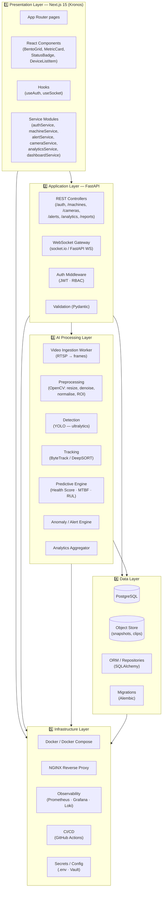

# Software Architecture — Layered View

The platform is structured as a **five-layer architecture** that isolates concerns, enforces dependency direction (top → bottom), and keeps the AI workload decoupled from the user-facing surface area.

---

## Layer Responsibilities

### 1️⃣ Presentation Layer — `frontend/` (Kronos · Next.js 15)
- **Role:** Render the operator console, capture user input, subscribe to real-time streams.
- **Tech:** Next.js 15 App Router, React 19, TypeScript, Tailwind 4, framer-motion, TanStack Query, axios, socket.io-client, js-cookie.
- **Modules:**
  - `src/app/` — routes (`/login`, `/dashboard`, `/dashboard/machines`, `/dashboard/cameras`, `/dashboard/alerts`, `/dashboard/analytics`, `/dashboard/reports`, `/dashboard/settings`).
  - `src/components/{ui,layout,shared}/` — Card, Button, Badge, Table, Sidebar, Header, MetricCard, BentoGrid, StatusBadge, DeviceListItem, ApiErrorState, LoadingSkeleton.
  - `src/hooks/` — `useAuth`, `useSocket`, plus `hooks/queries/*` (`useDashboard`, `useMachines`, `useCameras`, `useAlerts`, `useAnalytics`).
  - `src/services/` — typed clients that map 1:1 to backend REST endpoints.
  - `src/lib/api.ts` — Axios instance with interceptors for JWT injection and 401 redirect.
  - `src/config/env.ts` — centralised `API_URL` (read from `.env.local`).
- **Concerns:** UI rendering, optimistic updates, real-time subscription, never directly touches the database.

### 2️⃣ Application Layer — `backend/` (FastAPI)
- **Role:** Expose business capabilities as REST + WebSocket, enforce auth, orchestrate AI workers, and own the system of record writes.
- **Tech:** Python 3.11, FastAPI, Pydantic v2, SQLAlchemy 2.x, python-socketio, APScheduler, Alembic.
- **Modules:**
  - **Controllers** — `routers/auth.py`, `routers/machines.py`, `routers/cameras.py`, `routers/alerts.py`, `routers/analytics.py`, `routers/reports.py`, `routers/settings.py`, `routers/dashboard.py`.
  - **Middleware** — `auth/jwt.py`, `auth/rbac.py` (roles: `admin | engineer | operator`).
  - **Schemas** — Pydantic models matching `src/types/api.ts` (e.g. `Alert`, `Machine`, `CameraStream`, `DashboardMetricsSummary`).
  - **WebSocket** — `/ws/telemetry` (live frames, status), `/ws/alerts` (push notifications).
  - **Worker Pool** — dispatches AI inference jobs and writes results back via repositories.
- **Concerns:** Stateless request handling, auth, validation, orchestration — no model weights here.

### 3️⃣ AI Processing Layer — `ai/`
- **Role:** Convert raw video into structured detections, track them across time, derive machine health, and emit alerts.
- **Tech:** Python 3.11, OpenCV, ultralytics (YOLOv8/v11), torch, numpy, pandas, scikit-learn, supervision (for tracking).
- **Modules:**
  - `ai/ingest/ffmpeg_worker.py` — RTSP pull, frame slicing, JPEG encoding.
  - `ai/vision/preprocess.py` — Resize, grayscale, denoise, ROI crop, normalise.
  - `ai/detector/yolo.py` — Inference + NMS, returns `[label, confidence, bbox]`.
  - `ai/tracker/bytetrack.py` — Stable IDs across frames.
  - `ai/predict/health_score.py` — Computes 0–100 health score using telemetry + visual signal.
  - `ai/predict/anomaly.py` — Threshold + statistical anomaly detection.
  - `ai/analytics/aggregator.py` — OEE, defect distribution, downtime totals.
- **Concerns:** Pure Python services; communicate with the Application Layer only via HTTP / queue.

### 4️⃣ Data Layer — `database/`
- **Role:** Persist users, machines, cameras, detections, alerts, reports, and analytics rollups.
- **Tech:** PostgreSQL 16, SQLAlchemy 2.x ORM, Alembic migrations, optional TimescaleDB / pgvector for embeddings.
- **Modules:**
  - `database/models/` — `user.py`, `role.py`, `machine.py`, `camera.py`, `detection.py`, `alert.py`, `maintenance.py`, `report.py`, `analytics.py`.
  - `database/repositories/` — encapsulated CRUD (`AlertRepository`, `MachineRepository`, `CameraRepository`, `DetectionRepository`, `AnalyticsRepository`).
  - `database/migrations/` — Alembic versioned migrations.
  - `database/seeders/` — initial admin + demo machine/camera fixtures.
  - `database/storage/` — local file system or S3-compatible adapter for snapshots/clips.
- **Concerns:** Durability, indexing, transactional integrity. The AI layer never writes here directly.

### 5️⃣ Infrastructure Layer — `docker/`, `docs/`
- **Role:** Container images, orchestration, networking, observability, CI/CD, secrets.
- **Tech:** Docker, Docker Compose, NGINX, Prometheus, Grafana, Loki, GitHub Actions.
- **Modules:**
  - `docker/` — `Dockerfile.frontend`, `Dockerfile.backend`, `Dockerfile.ai`, `docker-compose.yml`.
  - `docker/nginx/` — TLS termination, reverse proxy, rate limiting.
  - `docker/prometheus/`, `docker/grafana/` — metrics + dashboards.
  - `.github/workflows/` — lint, test, build, push, deploy.
  - `docs/` — architecture, ADRs, runbooks.
- **Concerns:** Operability, scalability, security at the platform boundary.
