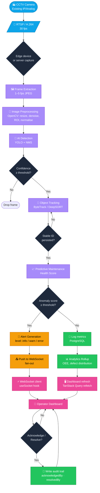

# Complete Workflow Diagram

This is the canonical end-to-end flow: from a physical camera to a notification in the operator's browser. The diagram is intentionally procedural so every step is auditable.

## Step-by-Step Explanation

| # | Stage | Component | Purpose |
|---|-------|-----------|---------|
| 1 | Camera | `CCTV` | Existing shop-floor cameras (no new hardware required). |
| 2 | Video Stream | `RTSP` | Native H.264 stream over the LAN. |
| 3 | Frame Extraction | `ai/ingest/ffmpeg_worker.py` | Decodes stream, samples at 1–5 FPS, encodes JPEG. |
| 4 | Image Preprocessing | `ai/vision/preprocess.py` | Resize to 640×640, denoise, ROI crop, channel normalisation. |
| 5 | AI Detection | `ai/detector/yolo.py` | YOLO inference → `[label, confidence, bbox]`. |
| 6 | Confidence Filter | Decision | Drops low-confidence detections to reduce false positives. |
| 7 | Object Tracking | `ai/tracker/bytetrack.py` | Maintains persistent IDs across frames. |
| 8 | Predictive Maintenance | `ai/predict/health_score.py` | Aggregates 30s/5min windows into a 0–100 health score. |
| 9 | Anomaly Decision | Decision | If score < threshold → alert; else just log. |
| 10 | Alert Generation | `ai/predict/anomaly.py` | Produces `Alert` records (`level: error/warn/info`). |
| 11 | Database Write | `database/repositories/AlertRepository` | Persists alert + detection + telemetry. |
| 12 | WebSocket Push | `backend/app/api/websocket.py` | Fans out to subscribed operator sessions. |
| 13 | Dashboard Refresh | TanStack Query | Auto-invalidates affected queries. |
| 14 | Operator Action | `useAuth` + `alertService` | Acknowledge / Resolve; writes audit trail. |

## Decision Points

- **Confidence threshold** — reduces noise; configurable per camera in `/dashboard/settings`.
- **Stable ID persistence** — short track histories are dropped to avoid spurious health-score swings.
- **Anomaly threshold** — two-stage: rolling-zscore AND a YOLO visual-defect signal.
- **Acknowledge vs. Resolve** — both produce immutable audit entries (operator/engineer roles).
