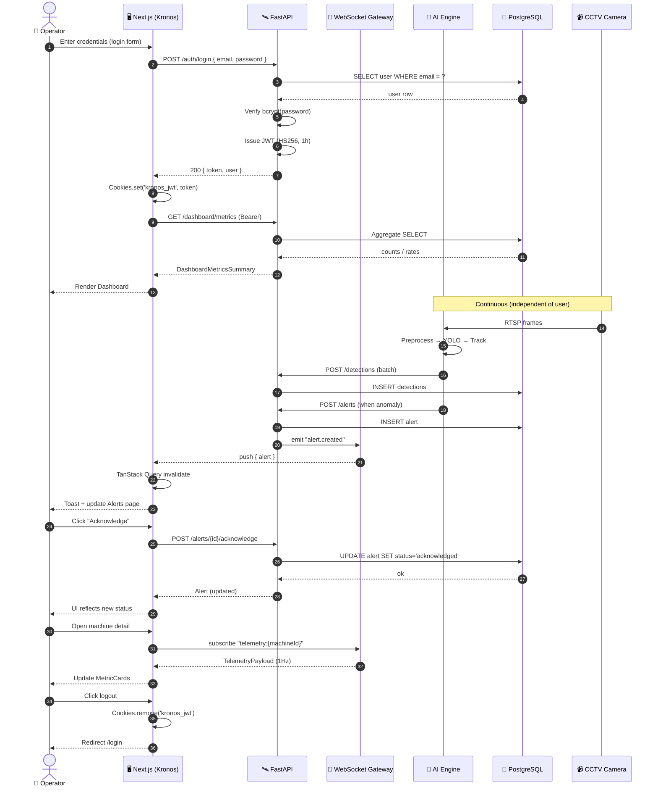

# Sequence Diagram — End-to-End Request Flow

This diagram captures the live interaction between an **Operator** and the system, including the cold REST path (login → dashboard) and the hot WebSocket path (live alert → acknowledge).

## Explanation

### Cold Path (REST)
1. **Login** — `authService.login()` posts to `/auth/login`; on success, the token is stored as a **secure SameSite=Strict cookie** named `kronos_jwt`.
2. **Dashboard** — `dashboardService.getMetricsSummary()` calls `GET /dashboard/metrics`. The Axios interceptor (`src/lib/api.ts:18-25`) attaches the bearer token automatically.
3. **Axios 401** — the response interceptor clears the cookie and redirects to `/login`.

### Hot Path (WebSocket)
1. The AI Engine writes a new alert through the FastAPI backend.
2. The backend emits the event to the WebSocket gateway.
3. The Next.js client (`useSocket`) receives the push and triggers a TanStack Query invalidation.
4. The dashboard updates with no manual refresh.

### Telemetry Stream
When the operator opens a machine detail page, the client subscribes to `telemetry:{machineId}`. The server pushes ~1 update/sec; the React component re-renders `MetricCard`s without an extra REST call.

### Audit Trail
Acknowledge and Resolve write `acknowledgedBy` / `resolvedBy` / timestamps and append a timeline entry, satisfying the compliance story for MSME quality audits.
