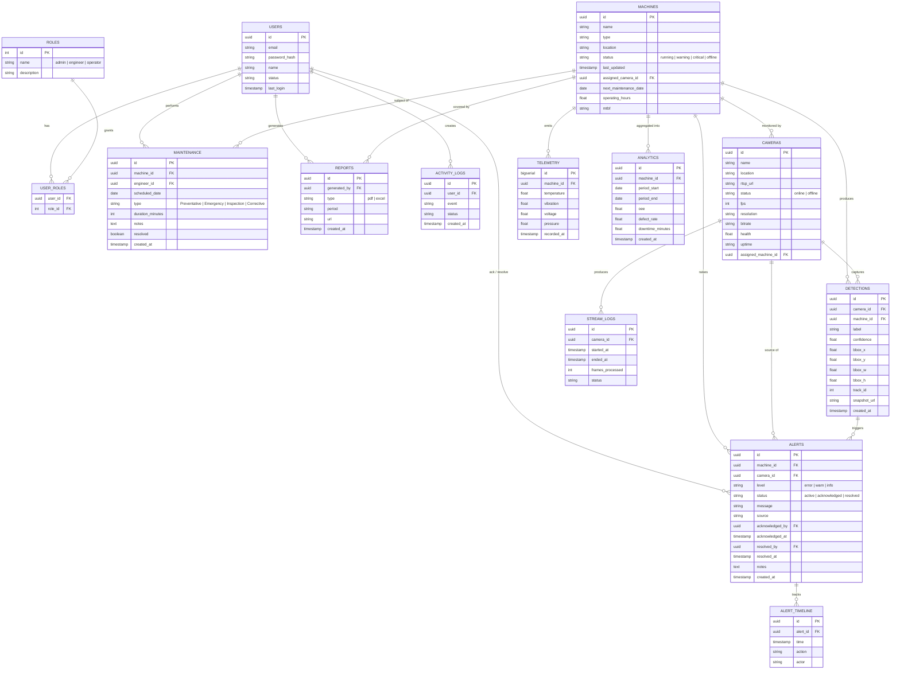

# Database Architecture

The data model is **relational-first** (PostgreSQL 16) with time-series and audit-friendly patterns. Ten core tables cover identity, fleet, detection, alerting, maintenance, and analytics.

## Table Summaries

### Identity
- **`users`** — operator/engineer/admin accounts; bcrypt password hashes; soft-deletable.
- **`roles`** — three fixed roles, seeded at migration time.
- **`user_roles`** — many-to-many join (reserved for future fine-grained permissions).

### Fleet
- **`machines`** — physical assets; one row per machine; `assigned_camera_id` is nullable 0..1.
- **`cameras`** — IP/analog cameras; `rtsp_url`, status, FPS, bitrate, health (0–100).
- **`stream_logs`** — lifecycle record of every camera session (helps debug ingest).

### Detection & Alerting
- **`detections`** — one row per accepted YOLO detection; includes `track_id` for stable correlation.
- **`alerts`** — derived from detection(s) or telemetry; carries lifecycle state.
- **`alert_timeline`** — append-only audit; satisfies "who did what when" requirements.

### Maintenance & Reporting
- **`maintenance`** — scheduled + ad-hoc maintenance; type, duration, engineer, outcome.
- **`reports`** — generated exports (`pdf`, `excel`); stored in object store with a URL.

### Telemetry & Analytics
- **`telemetry`** — append-only time-series (consider TimescaleDB hypertable).
- **`analytics`** — pre-aggregated rollups (OEE, defect rate, downtime).

## Indexing Strategy

| Index | Purpose |
|---|---|
| `idx_detections_camera_time` `(camera_id, created_at DESC)` | Latest-detections query |
| `idx_alerts_status_level` `(status, level)` | Active alert dashboard |
| `idx_telemetry_machine_time` `(machine_id, recorded_at DESC)` | Health score window |
| `idx_machines_status` `(status)` WHERE status != 'running' | "Needs attention" panel |
| `idx_alerts_machine_time` `(machine_id, created_at DESC)` | Per-machine alert history |

## Data Retention

- **Detections** — keep 30 days online, archive to cold storage.
- **Telemetry** — keep 90 days at full resolution, downsample to 1 min beyond.
- **Alerts + Timeline** — keep indefinitely (audit).
- **Reports** — keep indefinitely with object-store lifecycle rules.
