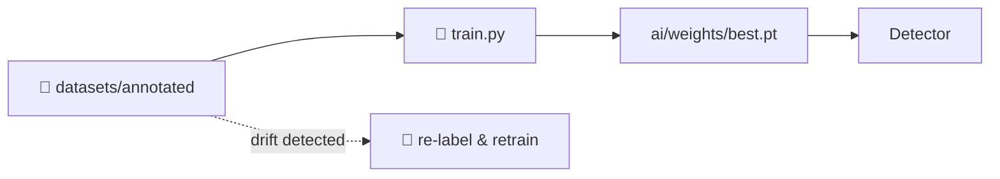

# AI Pipeline — From Frame to Alert

The AI pipeline is a **chain of pure-functional Python services** that progressively turns raw video into a decision. Each stage is independently testable and replaceable.

```mermaid
flowchart LR
    A[📹 Video Input<br/>RTSP H.264] --> B[🖼️ Frame Extraction<br/>1–5 fps · JPEG]
    B --> C[🎨 Preprocessing<br/>OpenCV: resize · denoise · ROI · normalise]
    C --> D[🧠 YOLO Detection<br/>YOLOv8/v11 · ultralytics]
    D --> E[🎯 Tracking<br/>ByteTrack / DeepSORT]
    E --> F[📐 Feature Extraction<br/>bbox · centroid · velocity · class]
    F --> G[📈 Anomaly Detection<br/>z-score · IForest · threshold rules]
    G --> H[🩺 Health Score<br/>0–100 · per machine]
    H --> I{score &lt; threshold?}
    I -- No --> J[📊 Log metrics]
    I -- Yes --> K[🚨 Alert<br/>level · message · source]
    K --> L[📤 Push<br/>Backend → WS → Dashboard]
    J --> M[🖥️ Dashboard<br/>refresh]
    L --> M

    classDef ai fill:#7c3aed,color:#fff,stroke:#4c1d95;
    classDef store fill:#16a34a,color:#fff,stroke:#14532d;
    classDef alert fill:#ea580c,color:#fff,stroke:#7c2d12;
    classDef ui fill:#ec4899,color:#fff,stroke:#be185d;
    class A,B,C,D,E,F ai;
    class G,H,J store;
    class I,K,L alert;
    class M ui;
```



## Stage-by-Stage

### 1. Video Input — `ai/ingest/ffmpeg_worker.py`
- Pulls RTSP via `ffmpeg -rtsp_transport tcp -i <url> -vf fps=2 frames/%05d.jpg`.
- One worker per camera; supervised by `stream_manager.py`.
- Backpressure: drop frames if the AI queue is full.

### 2. Frame Extraction
- Output: `(H, W, 3)` BGR arrays in shared memory.
- FPS target is configurable per camera (default 2 FPS, range 1–10).

### 3. Preprocessing — `ai/vision/preprocess.py`
```python
def preprocess(frame):
    frame = cv2.resize(frame, (640, 640))
    frame = cv2.GaussianBlur(frame, (5, 5), 0)
    frame = roi_crop(frame, camera.roi)
    frame = frame / 255.0
    return frame
```

### 4. YOLO Detection — `ai/detector/yolo.py`
- Model: `yolov8n.pt` (or custom-trained `.pt` in `ai/weights/`).
- Returns `[{label, confidence, bbox}]` after NMS.
- Confidence threshold default `0.45`; configurable per camera in `/settings/cameras`.

### 5. Tracking — `ai/tracker/bytetrack.py`
- Stable IDs across frames using ByteTrack (lightweight, no ReID network).
- Maintains `(track_id → history)` in memory; flushes to DB every 5 s.

### 6. Feature Extraction
- Per track: centroid velocity, bounding-box aspect ratio, time-on-screen, class label.
- Per machine (rolling 5 min): mean & std of temperature proxy, vibration proxy, defect counts.

### 7. Anomaly Detection — `ai/predict/anomaly.py`
- **Statistical** — rolling z-score on telemetry features (warn at |z| > 2, error at |z| > 3).
- **Visual** — sudden increase in defect-class counts or appearance of new classes.
- **Isolation Forest** — trained on 30 days of normal features, score per 5-min window.

### 8. Health Score — `ai/predict/health_score.py`
```
health = 100
        - 0.5 * max(0, temperature - 75)         # thermal penalty
        - 5   * max(0, vibration - 4)            # vibration penalty
        - 2   * z_anomaly                        # anomaly penalty
        - 10  * active_defect_count              # defect penalty
clamp(0, 100)
```

### 9. Alert Generation
- Threshold: `health < 70` → `warn`, `health < 40` → `error`.
- Includes context: which camera, which detection, last-known metrics.
- Posts to `POST /api/v1/alerts` (or queues via Redis).

### 10. Push to Dashboard
- Backend emits over WebSocket (`/ws/alerts`).
- Frontend (`useSocket` + TanStack Query invalidation) updates UI.

## Training & Dataset Loop



- Datasets live under `datasets/annotated/` in YOLO format.
- `ai/notebooks/` holds exploratory notebooks.
- Retraining triggered when drift detector flags accuracy regression on the validation split.
