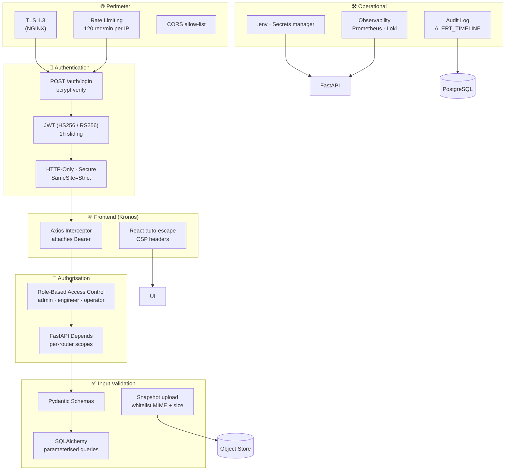

# Security Architecture

Security is layered. **No single control is trusted in isolation**; the platform combines transport security, authentication, authorisation, input validation, and operational hygiene.

## Controls in Detail

### 1. JWT Authentication
- Algorithm: **HS256** in dev, **RS256** in production (rotated via JWKS).
- Claims: `sub` (user id), `role`, `iat`, `exp`.
- Lifetime: **1 hour** with **sliding refresh** on `/auth/refresh`.
- Storage: **HTTP-Only, Secure, SameSite=Strict** cookie (`kronos_jwt`) — eliminates XSS surface.
- Verification: Axios interceptor (`src/lib/api.ts:18-25`) attaches the token to every request; FastAPI dependency `get_current_user` decodes and validates.

### 2. Role-Based Access Control (RBAC)
Three roles, matching the existing `User` type:
| Role | Capabilities |
|---|---|
| `admin`   | Full CRUD on users, roles, settings, all machines & cameras |
| `engineer`| Acknowledge / resolve alerts, update cameras, trigger reports |
| `operator`| Read-only dashboard + acknowledge alerts assigned to them |

Enforced by FastAPI `Depends` per-router; mirrored in the UI (sidebar items hidden when role lacks access).

### 3. HTTPS / Transport Security
- TLS 1.3 enforced at NGINX.
- HSTS header: `max-age=63072000; includeSubDomains; preload`.
- HTTP → HTTPS redirect at the edge.
- WebSocket (`wss://`) terminated by NGINX with `proxy_http_version 1.1` + `Upgrade`.

### 4. Input Validation
- **Pydantic v2** on every request body and query parameter — 422 on schema violation.
- **Path parameters** typed (`machine_id: UUID`).
- **SQL**: SQLAlchemy parameterised queries only; no string interpolation.
- **File uploads**: MIME whitelist (`image/jpeg`, `image/png`), max size 5 MB, virus-scan hook reserved.

### 5. API Security
- **Rate limiting** — 120 req/min/IP via NGINX; stricter limits on `/auth/login` (10/min).
- **CORS** — explicit allow-list; no wildcards in production.
- **CSRF** — cookie SameSite=Strict + double-submit token for state-changing endpoints.
- **OpenAPI** exposed at `/api/v1/docs` only in non-production environments.

### 6. Password Hashing
- **bcrypt** with cost factor 12.
- Optional pepper in environment variable (`PASSWORD_PEPPER`) for defence in depth.
- Password complexity enforced at registration (length, character classes).

### 7. Environment Variables & Secrets
- All secrets in `.env` files (or a secrets manager in production).
- `.env` files in `.gitignore`; only `.env.example` is committed.
- Frontend: only `NEXT_PUBLIC_*` variables are exposed to the browser.
- Backend: secrets loaded once via Pydantic Settings; never logged.

### 8. Logging & Audit
- **Audit** — every `acknowledge` / `resolve` writes to `ALERT_TIMELINE` (immutable).
- **Logs** — structured JSON; sensitive fields (passwords, tokens) redacted.
- **Metrics** — Prometheus exporters on backend, AI service, and NGINX.

### 9. Frontend Hardening
- React auto-escapes all strings → default XSS protection.
- Content-Security-Policy: `default-src 'self'; img-src 'self' https: data:; connect-src 'self' wss:;`.
- No `dangerouslySetInnerHTML` in the codebase (search-verifiable).
- Tokens in cookies, **not** `localStorage`.

## Threat Model Summary

| Threat | Mitigation |
|---|---|
| Credential stuffing | Rate limit + bcrypt (slow) + lockout after 5 failed attempts |
| Token theft | HTTP-Only cookie + Secure + SameSite=Strict + short lifetime |
| XSS | React auto-escape + CSP + no `dangerouslySetInnerHTML` |
| CSRF | SameSite=Strict + double-submit token |
| SQL injection | SQLAlchemy parameterised queries |
| Path traversal | Pydantic UUID types; no string path concatenation |
| RTSP credential leakage | Stored encrypted in DB; never logged |
| Insider abuse | Append-only audit trail; least-privilege RBAC |
